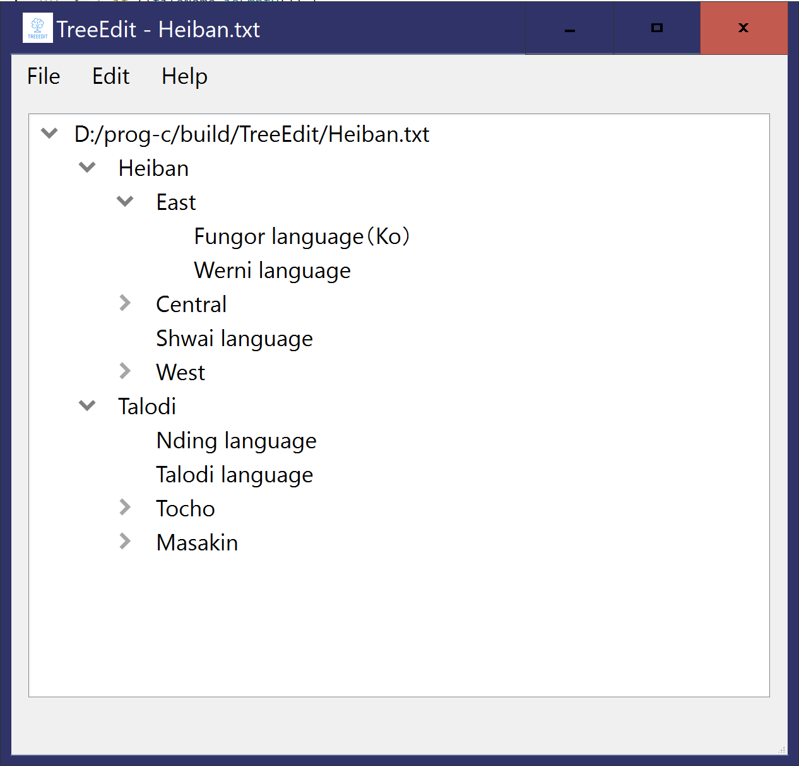

# TreeEdit

TreeEdit is an app that reads tree structure for edit/conversion.

The following text would be converted into tree structure as shown.

<pre>
* Heiban
** East
*** Fungor language（Ko）
*** Werni language
** Central
*** Koalib language
*** Logol language
*** Laro language
*** Heiban language
*** Otoro language
** Shwai language
** West
*** Tiro language
*** Moro language
* Talodi
** Nding language
** Talodi language
** Tocho
*** Tocho language
*** Acheron language
*** Lumun language
*** Torona language
** Masakin
*** Ngile language
*** Dengebu language  
</pre>

The nodes are editable. 

Currently, you can only save the tree structure in JSON format. The JSON formatted file can be loaded into the app.
